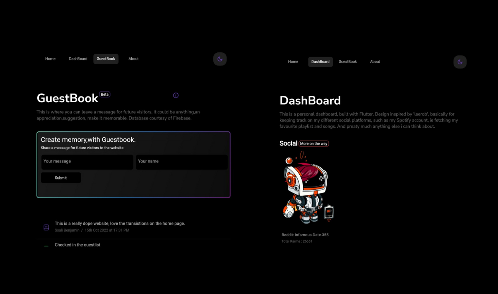
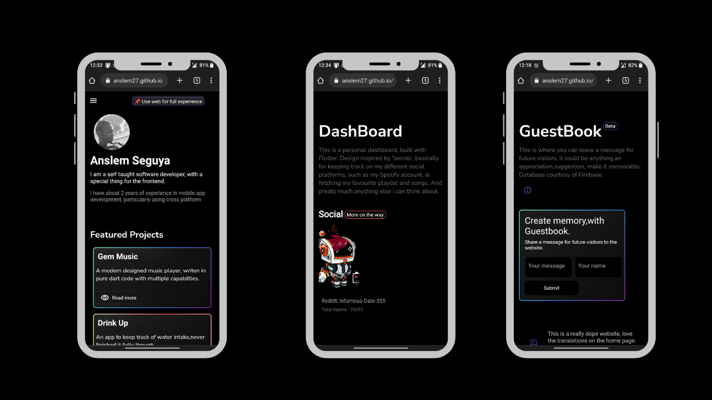

# Anslem27.github.io
<!-- Live Build -->
- [Check out live build here](https://anslem27.github.io/)
- [Check out base repository here](https://anslem27.github.io/)

**Kindly star, if you earn anything from the repo, and contributions are highly reccomended.**

### My personal portfolio website written with 💙flutter
<!-- Showcase HomePage -->

__`Note` that this compiled version of the base repository.__

### Note

- This build is based on the canvas renderer. `flutter build web --web-renderer canvaskit`

### What's included or used

- Github Api
- Reddit about user json url.  `https://www.reddit.com/user/USER/about.json`
- Spotify Api.
- Firebase for simple online database.

### Contributions

 If by any chance you wish to contribute to this repository, or vote to make it opensource,kindly reach me via [email](mailto:anslembarn@gmail.com).

If you also have any inquiries about this repository, or special components,as well as bugs, or feature requests, please contact still by email, i'll surely reply.

### ScreenShots

<!-- Mobile -->

### Acknowledgements

Design inspired by [Leerob's personal portfolio](https://leerob.io/), sure you'll see a big resemblance.

### __WebSite View Count__

